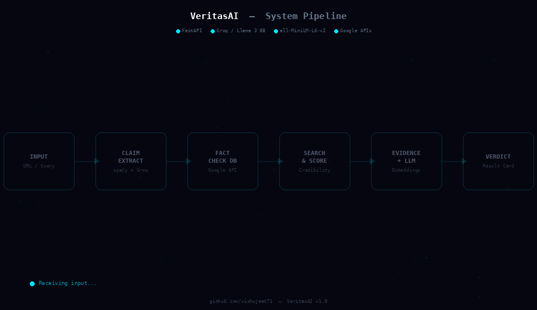

# VeritasAI

This project aims to build a practical, end-to-end AI system for automated fact-checking. It takes user input (text or URL), identifies verifiable claims, and evaluates them using a structured verification pipeline to produce a clear, evidence-backed verdict.

## Core Problem It Solves

Most fact-checking today is either:

- Manual → slow and effort-heavy
- Automated → shallow (just summarizing search results)

Both approaches fail at reliable verification.

VeritasAI addresses this by:

- Extracting only checkable factual claims (ignores opinions/noise)
- Prioritizing verified fact-check databases
- Ranking sources using credibility scoring
- Finding relevant evidence using semantic similarity
- Using an LLM to reason over evidence, not just summarize

## System Overview

## Goal of This Project

The goal is to build a real, usable system that:

- Produces reliable, explainable fact-check results
- Combines multiple techniques (NLP + IR + LLMs)
- Can evolve into a production-level tool
